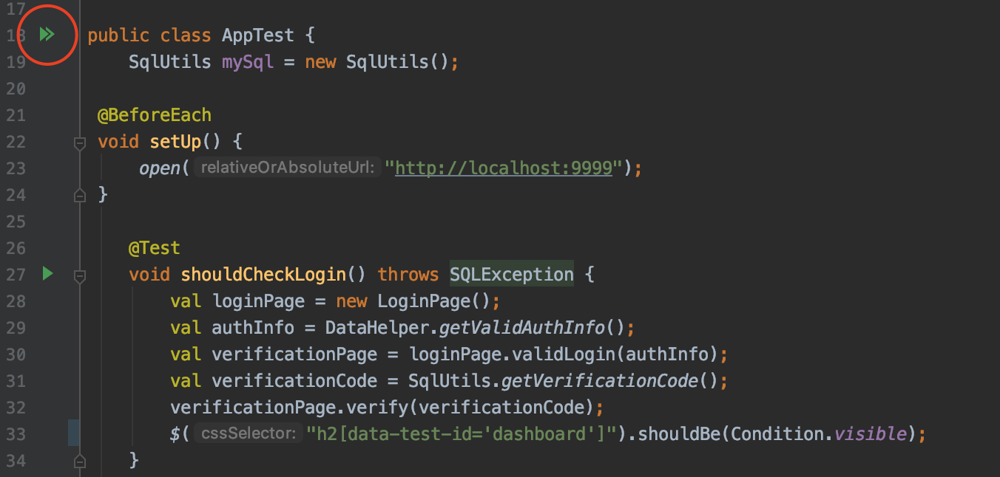

## SQL - первое задание  
Тестирование входа в систему через веб-интерфейс. 

[](https://ci.appveyor.com/project/viktoria-sap/sql)
 

### Инструкция по установке
* Открыть SQL - первое задание; 
* Развернуть базу,  используя команду 
```
docker-compose up -d
```
* Запустить приложение с помощью команды 
```
java -jar ./artifacts/app-deadline.jar
```
* Запустить тесты


